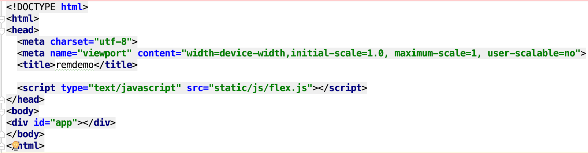

# postcss-px2rem + flex.js解决屏幕适配问题
## postcss-px2rem的作用
作用：将项目中的px单位转换为rem单位

## postcss-px2rem的使用步骤
+ 安装postcss-plugin-px2rem

        npm install --save-dev postcss-px2rem
		
+ vue-loader.config.js配置
		
		'use strict'
		const utils = require('./utils')
		const config = require('../config')
		const isProduction = process.env.NODE_ENV === 'production'
		const sourceMapEnabled = isProduction
		  ? config.build.productionSourceMap
		  : config.dev.cssSourceMap
		  
		/*引入postcss-px2rem 通过require的形式*/ 
		var px2rem = require('postcss-px2rem');
		
		module.exports = {
		  loaders: utils.cssLoaders({
		    sourceMap: sourceMapEnabled,
		    extract: isProduction,
		    
		    /*允许使用usePostCSS*/
		    usePostCSS:true,
		    
		  }),
		  cssSourceMap: sourceMapEnabled,
		  cacheBusting: config.dev.cacheBusting,
		  transformToRequire: {
		    video: ['src', 'poster'],
		    source: 'src',
		    img: 'src',
		    image: 'xlink:href'
		  },
		  
		  /*配置remUnit*/
		  postcss: function() {
		    return [px2rem({remUnit: 37.5})];
		  }
	}

+ remUnit为1rem应的px值，可以自己进行定义。一般就选37.5，对应iphone6的宽度。
+ 到这一步位置，实际上已经将项目的px单位转换为rem了(需重启)，但是还需要对html根元素进行相关设置。因此可以在index.html中添加如下代码，其中html元素的font-size的比例设置为与remUnit相同。比如remUnit以375/10的计算值37.5作为单位，那么font-size的比例也应该为10，故用浏览器宽度/10。但是！！！这里有一个问题，当屏幕宽度改变时，需要手动刷新，才能改变html的font-size，并且不够智能。

		
		

## flex.js(或flexible.js)的作用
作用：响应式的修改html标签的font-size大小。 
解决了前面所说的，当屏幕尺寸发生变化时，需要手动刷新界面的问题。

## flex.js(或flexible.js)的使用步骤
在index.html中通过script标签引入即可。引入改js文件后，当屏幕尺寸发生改变时，发现html标签的font-size值是跟着变化的(假设大小为rootSize)，而在这个过程中各个元素的rem值保持恒定不变的(假设为el)，那么元素的实际px为 rootSize*el 可见是随着rootSize变化的。 

这里还有一个值得注意的地方，index.html中有一个meta属性，这里的initial-scale=1.0, maximum-scale=1 影响很大，flex.js中会利用到它，如果不设置1.0的值，则会默认为2.0，字体会比较大。

    <meta name="viewport" content="width=device-width,initial-scale=1.0, maximum-scale=1, user-scalable=no">

## 扩展阅读
1. [移动Web适配利器-rem](http://www.alloyteam.com/2016/03/mobile-web-adaptation-tool-rem/)
2. [使用Flexible实现手淘H5页面的终端适配-阅读吗-470667](https://www.w3cplus.com/mobile/lib-flexible-for-html5-layout.html)
3. [Vue项目使用vw实现移动端适配教程](https://www.jianshu.com/p/eb0d00e8ffed)